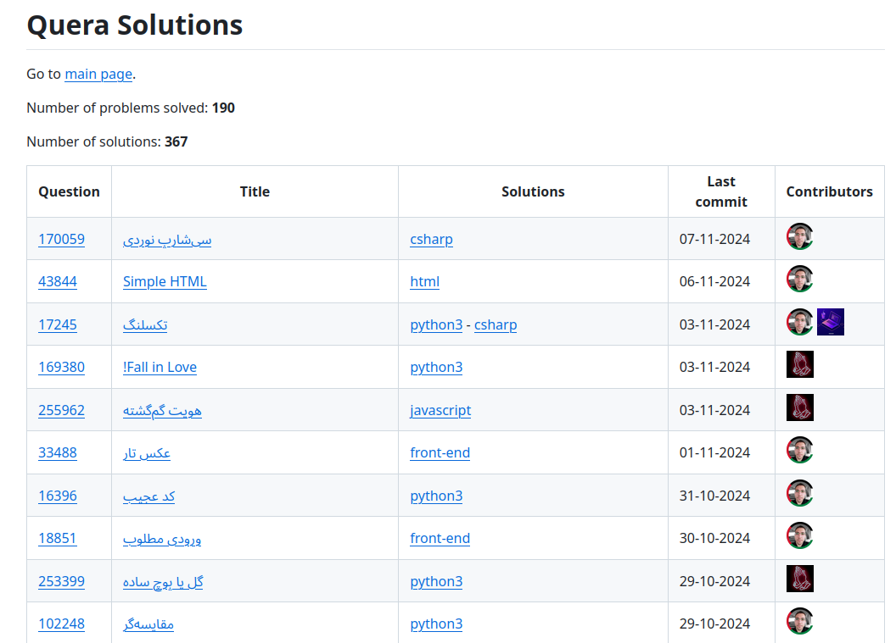

  <h1>Quera Readme Generator</h1>
   
  <a href="#getting-started"><strong>Getting Started »</strong></a>
   
   
  <a href="https://github.com/HamidMolareza/QueraReadmeGenerator/issues/new?assignees=&labels=bug&template=BUG_REPORT.md&title=bug%3A+">Report a Bug</a>
  ·
  <a href="https://github.com/HamidMolareza/QueraReadmeGenerator/issues/new?assignees=&labels=enhancement&template=FEATURE_REQUEST.md&title=feat%3A+">Request a Feature</a>
  .
  <a href="https://github.com/HamidMolareza/QueraReadmeGenerator/issues/new?assignees=&labels=question&template=SUPPORT_QUESTION.md&title=support%3A+">Ask a Question</a>

 

## About

**ReadmeGenerator** is a C# command-line application designed to automatically generate and update README tables
for [Quera](https://github.com/hamidMolareza/Quera) solutions repositories based on commit logs. It simplifies the
process of maintaining
organized and up-to-date documentation, reducing manual effort and ensuring consistency. The tool is built with Docker
support for easy deployment and can be integrated into any Git-based project.

### Demo

Screenshots

 

### How It Works

**ReadmeGenerator** works by analyzing commit logs, extracting relevant information such as problem names, solution
links, and contributors, and then populating a well-structured table in your README file. The application is composed of
several modules, including:

- **Collector:** Gathers commit information and parses it for relevant details.
- **Generator:** Takes the parsed data and generates the README table.
- **Cache:** Caches the data to speed up subsequent runs.
- **Helpers:** Utility functions for Git operations, Bash execution, and Gravatar support for contributor images.

## CHANGELOG

PLease see the [changelog.md](./CHANGELOG.md)

## Roadmap

See the [open issues](https://github.com/HamidMolareza/QueraReadmeGenerator/issues) for a list of proposed features (and
known
issues).

- [Top Feature Requests](https://github.com/HamidMolareza/QueraReadmeGenerator/issues?q=label%3Aenhancement+is%3Aopen+sort%3Areactions-%2B1-desc) (
  Add your votes using the 👍 reaction)
- [Top Bugs](https://github.com/HamidMolareza/QueraReadmeGenerator/issues?q=is%3Aissue+is%3Aopen+label%3Abug+sort%3Areactions-%2B1-desc) (
  Add your votes using the 👍 reaction)
- [Newest Bugs](https://github.com/HamidMolareza/QueraReadmeGenerator/issues?q=is%3Aopen+is%3Aissue+label%3Abug)

## Support

Reach out to the maintainer at one of the following places:

- [GitHub issues](https://github.com/HamidMolareza/QueraReadmeGenerator/issues/new?assignees=&labels=question&template=SUPPORT_QUESTION.md&title=support%3A+)
- Contact options listed on [this GitHub profile](https://github.com/HamidMolareza)

## Contributing

First off, thanks for taking the time to contribute! Contributions are what make the free/open-source community such an
amazing place to learn, inspire, and create. Any contributions you make will benefit everybody else and are **greatly
appreciated**.

Please read [our contribution guidelines](docs/CONTRIBUTING.md), and thank you for being involved!

## Authors & contributors

The original setup of this repository is by [HamidMolareza](https://github.com/HamidMolareza).

For a full list of all authors and contributors,
see [the contributors page](https://github.com/HamidMolareza/QueraReadmeGenerator/contributors).

## Security

QueraReadmeGenerator follows good practices of security, but 100% security cannot be assured. QueraReadmeGenerator is
provided **"as
is"** without any **warranty**.

_For more information and to report security issues, please refer to our [security documentation](docs/SECURITY.md)._

## License

This project is licensed under the **GPLv3**.

See [LICENSE](LICENSE) for more information.

---

For further details on how to use the application or integrate it with your own projects, check out the documentation or
feel free to open an issue for support.

